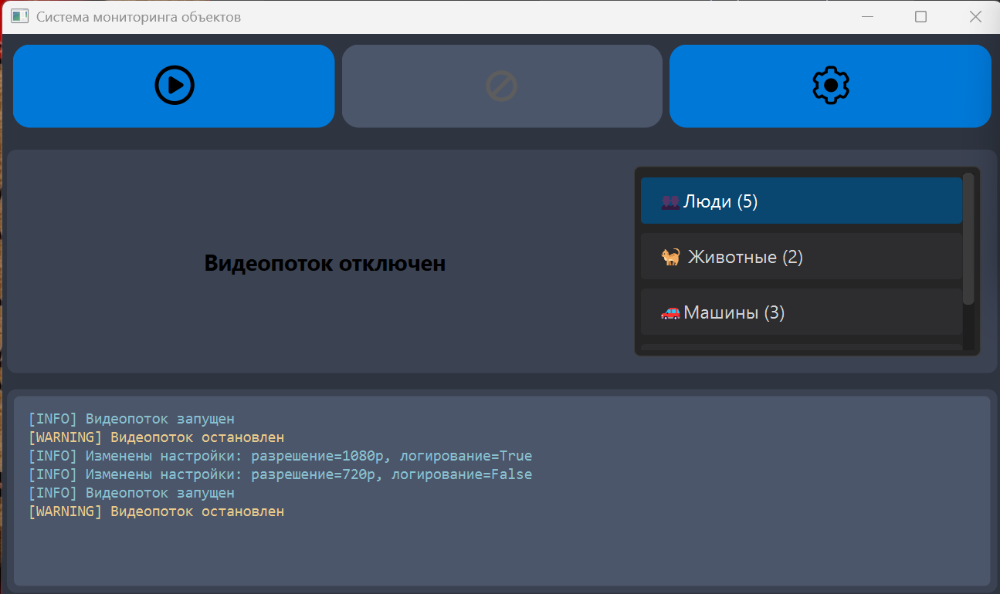

# 📹 Система мониторинга объектов



## 🌟 О проекте
Современное настольное приложение для мониторинга объектов в реальном времени с визуализацией видеопотока, списком обнаруженных объектов и логами событий. Идеально подходит для систем видеонаблюдения, анализа трафика и других сценариев, где требуется отслеживать объекты.

> "Представь, что ты шпион из будущего, но вместо секретных операций следишь за тем, как кошка пытается утащить твой бутерброд. Этот интерфейс — твой цифровой бинокль, только круче!"

## ✨ Основные функции

- 🎥 Воспроизведение и остановка видеопотока
- 📊 Отображение списка обнаруженных объектов (люди, машины, животные и др.)
- 📝 Логирование событий с цветовой маркировкой
- ⚙️ Настройка разрешения видеопотока
- 🌓 Современный темный интерфейс для комфортной работы

## 🛠 Требования

- Python 3.8+
- PyQt6

## 🚀 Установка и запуск

1. Клонируйте репозиторий:
   ```bash
   git clone https://github.com/ваш-логин/monitoring-app.git
   cd monitoring-app
   ```

2. Установите зависимости:
   ```bash
   pip install PyQt6
   ```

3. Запустите приложение:
   ```bash
   python app.py
   ```

## 📂 Структура проекта

```
monitoring-app/
├── app.py            # Основной скрипт приложения
├── proba.ui          # UI-файл интерфейса, созданный в Qt Designer
├── resources/        # Папка с иконками (если используются)
│   ├── play.png
│   ├── stop.png
│   └── settings.png
├── screenshots/      # Скриншоты интерфейса
│   └── main.png
└── README.md         # Этот файл
```

## 🎨 Принципы дизайна

### 💡 Идея
При разработке дизайна я представлял, как пользователь будет проводить часы перед этим экраном. Главное — сделать так, чтобы интерфейс не отвлекал от основной задачи: наблюдения за видеопотоком.

### 🌈 Цветовая схема
- **Основная тема**: Темная (Nocturnal Theme)
- **Основной фон**: `#2E3440` (отлично подходит для длительного наблюдения)
- **Фон панелей**: `#3B4252` (создает визуальную иерархию)
- **Акцентные цвета**:
  - Кнопки: `#0078D7` (привлекает внимание)
  - Выбор элемента: `#8FBCBB` (мягкий акцент)
  - Логирование: 
    - INFO: `#88C0D0` (голубой)
    - WARNING: `#EBCB8B` (желтый)
    - ERROR: `#BF616A` (красный)

### 📐 Расположение элементов

1. **Верхняя панель управления** (10%)
   - Расположена в самом верху
   - Содержит три основные кнопки: Play, Stop, Settings
   - Размер кнопок 72x72 пикселя для удобного доступа

2. **Центральная область** (80%)
   - **Видеопоток** (70%): Главный элемент интерфейса, текст центрирован и выделен жирным шрифтом
   - **Список объектов** (30%): Расположен справа, ширина 300px, элементы с цветовой маркировкой

3. **Панель логов** (10%)
   - Расположена внизу
   - Использует моноширинный шрифт для лучшей читаемости
   - Автоматическая прокрутка к последней записи

### ✨ Визуальные элементы
- Закругленные углы (4-8px) для современного вида
- Тени при наведении для улучшения восприятия интерактивности
- Плавные переходы для плавности взаимодействия
- Иконки вместо текста для экономии пространства
